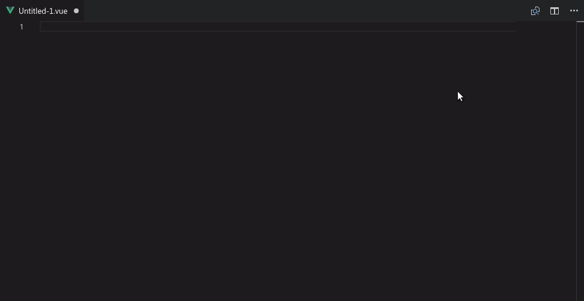

# vscode-quasar-snippets

Quasar framework is an awesome project isn't it? But, do you find it tedious to remember the basic syntax for all the components it provides. So, this simple plugin is here to help you solving this problem.

## Features

This plugin provides snippets with the basic usage syntax for the most used components of quasar-framework (All components soon).

All you need to do is typing the component's name **all in lowercase** and press tab. (all components will follow this logic).

``` html
qlayout + [tab] => <q-layout view="hHr LpR lFf"></q-layout>
```



For components properties, I tried to provide just the essential ones that are needed in most cases. The ones that are not used frequently can be looked up in the documentation. But if you find me missing some important property that is used frequently with a given component, don't hesitate to let me know.

## Contribution Guide

This plugin is still in development. Please don't get upset if you don't find a given component and feel free to contribute instead. Your contributions of all sorts are welcome. Here are some guidelines to consider when submitting a contribution.

- If you find a bug or you have a suggestion, feel free to open an issue for it.
- If you want to add a new snippet or fix an existing bug, please open an issue for that (if it is not already open) and indicate that you are working on it to avoid working on the same issue by other developers.
- Make sure to keep snippets organized according to the official documentation of quasar.
- Snippet prefix must be the lowercase version of the component's name ex: QProgress => qprogress.
- Snippet body must include only the most used properties. Component doc "Basic Usage" section is enough in *most* cases.
- Snippet description can be the doc description of the component if it is small or just a meaningful part of it if it is long.

Again, your contributions of all sorts are welcome :heart:

**Enjoy!**
